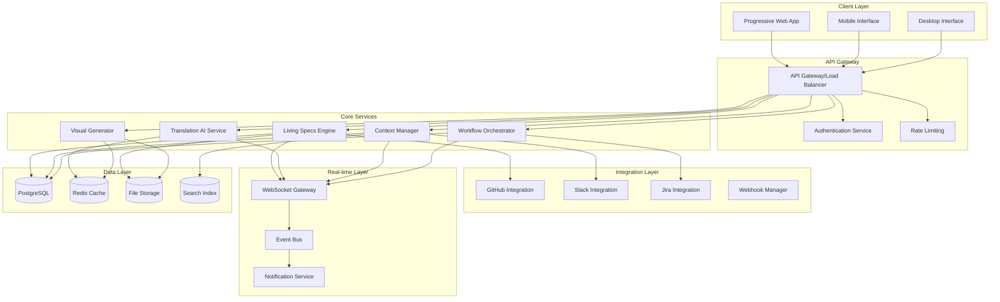
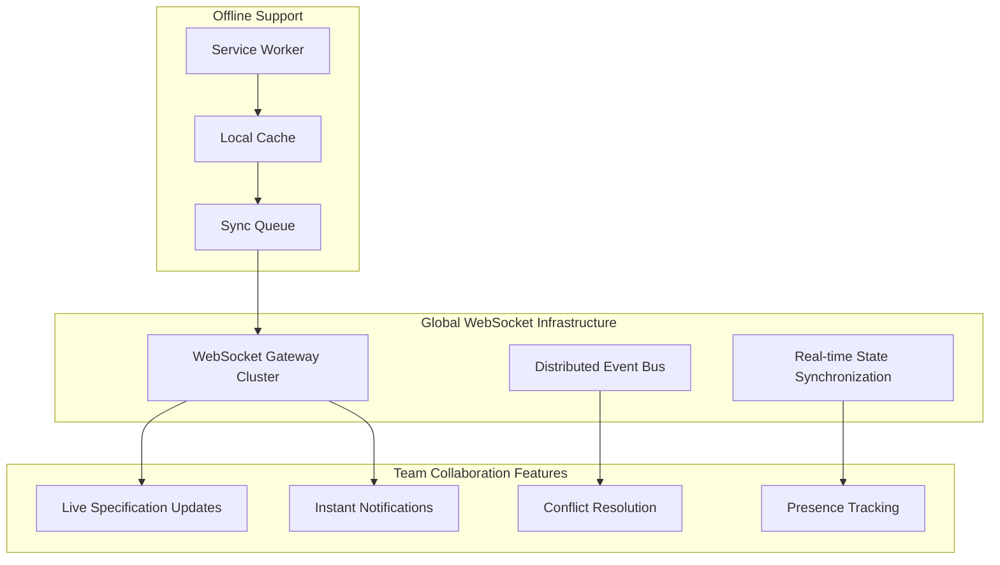

# CollabSpec Platform Design Document

## Overview

CollabSpec is a browser-based intelligent collaboration platform specifically designed to optimize distributed team workflows and eliminate the 35% productivity loss experienced by remote development teams. The platform uses a microservices architecture with real-time WebSocket synchronization, AI-powered translation between business and technical contexts, and seamless integration with existing development tools.

**Core Architecture Pillars for Distributed Teams:**
1. **Real-time WebSocket System** - Live specification updates across all team members with <500ms latency
2. **AI Translation Service** - Automatic conversion between technical and business language for cross-functional alignment
3. **Context Preservation Engine** - Intelligent conversation linking that maintains project context across time zones
4. **Integration API Layer** - Unified interface to GitHub, Slack, Jira without workflow disruption
5. **Progressive Web App Architecture** - Offline-first design enabling productivity regardless of connectivity
6. **Scalable Database Design** - Optimized for 100+ concurrent users with horizontal scaling capabilities

The system operates entirely within browser security constraints while providing native app-like performance for mobile-responsive collaboration across distributed teams.

## Architecture

### High-Level Architecture



### Technology Stack

**Frontend (Progressive Web App Architecture):**
- React 18 with TypeScript for component-based UI optimized for distributed teams
- Redux Toolkit with RTK Query for state management and offline synchronization
- Socket.io-client for real-time WebSocket communication (<500ms updates)
- Material-UI with custom distributed team collaboration components
- Progressive Web App (PWA) with offline-first architecture
- Service Workers for background sync and push notifications
- IndexedDB for local data persistence during connectivity issues
- Responsive design optimized for mobile collaboration scenarios

**Backend (Microservices for Distributed Teams):**
- Node.js with Express.js framework optimized for async workflows
- TypeScript for type safety across distributed development
- Socket.io cluster for WebSocket management supporting 100+ concurrent users
- JWT with refresh tokens and timezone-aware session management
- Microservices architecture with Docker containers for horizontal scaling
- Event-driven architecture for real-time collaboration
- API Gateway with rate limiting and load balancing for global access

**Database & Storage (Scalable for 100+ Users):**
- PostgreSQL with read replicas for primary data storage and global distribution
- Redis Cluster for caching, session management, and real-time collaboration state
- Elasticsearch for full-text search across conversations and specifications
- AWS S3 or compatible for file storage with CDN for global asset delivery
- Database connection pooling optimized for concurrent user load
- Automated backup and disaster recovery for distributed team continuity

**Infrastructure (Global Distribution):**
- Kubernetes for container orchestration with multi-region deployment
- NGINX for load balancing and reverse proxy with geographic routing
- TLS 1.3 for secure communication across distributed teams
- Horizontal auto-scaling based on load and timezone activity patterns
- CDN integration for global asset delivery and reduced latency

## Distributed Team Workflow Optimization

### Real-Time WebSocket System Architecture

The WebSocket system is specifically designed to handle distributed team collaboration challenges:



**Key Features for Distributed Teams:**
- **Presence Awareness:** Real-time visibility of who's online across time zones
- **Conflict-Free Collaboration:** Operational Transform (OT) for simultaneous editing
- **Offline Resilience:** Queue operations during connectivity issues
- **Smart Reconnection:** Automatic reconnection with state recovery

### AI Translation Service for Cross-Functional Teams

The AI translation engine bridges the communication gap between technical and business stakeholders:

**Translation Pipeline:**
1. **Context Analysis:** Understand project domain and stakeholder roles
2. **Language Detection:** Identify technical vs. business language patterns  
3. **Progressive Translation:** Generate layered explanations for different audiences
4. **Feedback Learning:** Improve translations based on team interactions

**Distributed Team Benefits:**
- Eliminates miscommunication across functional boundaries
- Reduces need for synchronous clarification meetings
- Maintains context for async decision-making
- Provides consistent terminology across global teams

### Context Preservation for Async Workflows

The context preservation engine maintains project knowledge across distributed workflows:

**Context Linking Architecture:**
- **Conversation Threading:** Link discussions to specific code changes and decisions
- **Decision Trails:** Maintain audit trails of why decisions were made
- **Smart Categorization:** Automatically organize conversations by relevance
- **Temporal Context:** Preserve context across different working hours

**Async Workflow Support:**
- **Handoff Summaries:** Automatic generation of context for next team member
- **Decision Queues:** Async decision-making with proper context preservation
- **Knowledge Transfer:** Seamless onboarding for new team members
- **Historical Search:** Find relevant context from past discussions

## Components and Interfaces

### 1. Living Specifications Engine

**Purpose:** Automatically maintains synchronization between specifications and code changes.

**Key Components:**
- **Spec Parser:** Converts natural language to structured specifications
- **Code Analyzer:** Monitors repository changes and extracts semantic meaning
- **Sync Manager:** Maintains bidirectional synchronization between specs and code
- **Conflict Resolver:** Handles discrepancies between specs and implementation

**Interfaces:**
```typescript
interface SpecificationEngine {
  parseNaturalLanguage(input: string): StructuredSpec;
  analyzeCodeChanges(changes: GitCommit[]): SpecificationUpdate[];
  syncSpecWithCode(specId: string, codeChanges: CodeChange[]): SyncResult;
  detectConflicts(spec: Specification, codebase: Repository): Conflict[];
}

interface StructuredSpec {
  id: string;
  title: string;
  userStories: UserStory[];
  acceptanceCriteria: AcceptanceCriteria[];
  technicalRequirements: TechnicalRequirement[];
  lastUpdated: Date;
  version: string;
}
```

### 2. Cross-Functional Translation Engine

**Purpose:** Bridges communication between technical and business stakeholders through AI-powered translation.

**Key Components:**
- **Business Translator:** Converts technical decisions to business impact summaries
- **Technical Translator:** Transforms business requirements into technical specifications
- **Context Analyzer:** Maintains understanding of project domain and terminology
- **Progressive Disclosure:** Provides layered information based on audience

**Interfaces:**
```typescript
interface TranslationEngine {
  translateToBusiness(technicalContent: TechnicalDecision): BusinessSummary;
  translateToTechnical(businessRequirement: BusinessRequirement): TechnicalSpec;
  generateProgressiveDisclosure(content: any, audienceLevel: AudienceLevel): LayeredContent;
  maintainContext(projectId: string, interactions: Interaction[]): ContextModel;
}

interface BusinessSummary {
  impact: string;
  risks: string[];
  benefits: string[];
  timeline: string;
  resources: ResourceRequirement[];
}
```

### 3. Intelligent Context Manager

**Purpose:** Preserves and categorizes conversation history linked to specific code changes.

**Key Components:**
- **Conversation Tracker:** Links discussions to code changes and decisions
- **Smart Categorization:** Automatically categorizes conversations by type and relevance
- **Context Search:** Enables semantic search across conversation history
- **Decision Trail:** Maintains audit trail of decisions and their rationale

**Interfaces:**
```typescript
interface ContextManager {
  linkConversationToCode(conversationId: string, codeChanges: CodeChange[]): void;
  categorizeConversation(conversation: Conversation): ConversationCategory;
  searchContext(query: string, filters: ContextFilter[]): ContextResult[];
  getDecisionTrail(codeElement: CodeElement): DecisionHistory[];
}

interface ConversationCategory {
  type: 'feature' | 'bug' | 'enhancement' | 'architecture' | 'process';
  priority: 'low' | 'medium' | 'high' | 'critical';
  stakeholders: string[];
  relatedComponents: string[];
}
```

### 4. Async Workflow Orchestrator

**Purpose:** Manages cross-timezone collaboration and intelligent task scheduling.

**Key Components:**
- **Timezone Optimizer:** Calculates optimal handoff times across team zones
- **Task Scheduler:** Manages task dependencies and team availability
- **Notification Router:** Delivers notifications based on team member preferences and availability
- **Workflow Engine:** Orchestrates complex multi-step processes across time zones

**Interfaces:**
```typescript
interface WorkflowOrchestrator {
  optimizeHandoffs(team: TeamMember[], tasks: Task[]): HandoffSchedule;
  scheduleTask(task: Task, constraints: SchedulingConstraint[]): ScheduleResult;
  routeNotification(notification: Notification, recipients: TeamMember[]): DeliveryPlan;
  orchestrateWorkflow(workflow: WorkflowDefinition, team: Team): WorkflowExecution;
}

interface HandoffSchedule {
  handoffs: Handoff[];
  optimalWindows: TimeWindow[];
  conflictResolutions: ConflictResolution[];
}
```

### 5. Visual Communication Hub

**Purpose:** Automatically generates diagrams, mockups, and visual representations from specifications.

**Key Components:**
- **Diagram Generator:** Creates architectural and flow diagrams from specifications
- **Mockup Generator:** Generates UI mockups from requirements
- **Visual Updater:** Maintains visual consistency when specifications change
- **Export Manager:** Provides multiple export formats for visual assets

**Interfaces:**
```typescript
interface VisualGenerator {
  generateDiagram(spec: Specification, diagramType: DiagramType): Diagram;
  createMockup(uiRequirements: UIRequirement[]): Mockup;
  updateVisuals(specChanges: SpecificationChange[]): VisualUpdate[];
  exportVisual(visual: Visual, format: ExportFormat): ExportResult;
}

interface Diagram {
  id: string;
  type: 'architecture' | 'flow' | 'sequence' | 'entity-relationship';
  content: string; // Mermaid or SVG content
  metadata: DiagramMetadata;
}
```

### 6. Integration API Layer (Workflow Continuity)

**Purpose:** Maintains seamless workflow continuity across existing tools without requiring teams to change their established processes.

**Key Components:**
- **GitHub Connector:** Real-time repository monitoring with bidirectional sync
- **Slack Connector:** Intelligent conversation capture with context preservation
- **Jira Connector:** Automatic ticket synchronization with specification updates
- **Webhook Manager:** Reliable webhook processing with retry mechanisms
- **Unified API Gateway:** Single interface for all external integrations
- **Workflow Bridge:** Maintains context across tool boundaries

**Distributed Team Workflow Benefits:**
- **Zero Context Switching:** Information flows automatically between tools
- **Async Workflow Preservation:** Maintains workflow state across time zones
- **Tool-Agnostic Collaboration:** Teams can use preferred tools without losing integration
- **Intelligent Routing:** Notifications delivered based on team member preferences and availability

**Interfaces:**
```typescript
interface IntegrationPipeline {
  connectGitHub(config: GitHubConfig): GitHubConnection;
  connectSlack(config: SlackConfig): SlackConnection;
  connectJira(config: JiraConfig): JiraConnection;
  processWebhook(webhook: Webhook): ProcessingResult;
}

interface GitHubConnection {
  monitorRepository(repoId: string): void;
  syncPullRequests(repoId: string): PullRequest[];
  createIssue(issue: IssueTemplate): GitHubIssue;
  getCommitHistory(repoId: string, since: Date): Commit[];
}
```

## Data Models

### Core Entities

```typescript
// Specification Management
interface Specification {
  id: string;
  projectId: string;
  title: string;
  description: string;
  userStories: UserStory[];
  acceptanceCriteria: AcceptanceCriteria[];
  technicalRequirements: TechnicalRequirement[];
  status: 'draft' | 'review' | 'approved' | 'implemented';
  version: string;
  createdAt: Date;
  updatedAt: Date;
  createdBy: string;
  stakeholders: string[];
}

// Team and User Management
interface TeamMember {
  id: string;
  name: string;
  email: string;
  role: 'developer' | 'designer' | 'product-manager' | 'stakeholder';
  timezone: string;
  availability: AvailabilityWindow[];
  skills: string[];
  preferences: NotificationPreferences;
}

// Context and Conversation
interface Conversation {
  id: string;
  projectId: string;
  participants: string[];
  messages: Message[];
  category: ConversationCategory;
  linkedCodeChanges: string[];
  linkedSpecifications: string[];
  createdAt: Date;
  updatedAt: Date;
}

// Integration Data
interface IntegrationEvent {
  id: string;
  source: 'github' | 'slack' | 'jira';
  eventType: string;
  payload: any;
  processedAt: Date;
  relatedEntities: string[];
}
```

### Database Schema Design

**PostgreSQL Tables (Optimized for 100+ Concurrent Users):**
- `projects` - Project metadata with timezone and team distribution info
- `specifications` - Living specification documents with version control
- `team_members` - User profiles with timezone, availability, and collaboration preferences
- `conversations` - Discussion threads with intelligent context linking
- `code_changes` - Tracked modifications with specification synchronization
- `workflows` - Async workflow definitions with timezone optimization
- `integrations` - External service configurations with failover support
- `notifications` - Intelligent notification queue with delivery optimization
- `collaboration_sessions` - Real-time collaboration state persistence
- `context_links` - Relationships between conversations, code, and specifications

**Redis Cache Structure (Distributed Team Optimization):**
- `session:{userId}` - User session data with timezone and presence info
- `realtime:{projectId}` - Live collaboration state for instant updates
- `cache:translations:{hash}` - AI translations with team-specific context
- `cache:visuals:{specId}` - Generated visual assets with version tracking
- `presence:{projectId}` - Real-time team member presence and activity
- `workflow_state:{workflowId}` - Async workflow progress across time zones
- `notification_queue:{userId}` - Personalized notification delivery queue

**Database Scaling Strategy:**
- **Read Replicas:** Geographic distribution for global team access
- **Connection Pooling:** Optimized for concurrent user load patterns
- **Partitioning:** Time-based partitioning for conversation and activity data
- **Indexing:** Optimized indexes for real-time collaboration queries

## Error Handling

### Error Categories and Strategies

**1. Integration Failures**
- **GitHub API Errors:** Implement exponential backoff with circuit breaker pattern
- **Slack/Jira Timeouts:** Queue operations for retry with dead letter queue
- **Webhook Failures:** Provide manual retry mechanisms and error notifications

**2. Real-time Communication Errors**
- **WebSocket Disconnections:** Automatic reconnection with exponential backoff
- **Message Delivery Failures:** Store-and-forward mechanism with offline sync
- **Conflict Resolution:** Last-writer-wins with manual conflict resolution UI

**3. AI Service Errors**
- **Translation Failures:** Fallback to cached translations or manual input
- **Visual Generation Errors:** Provide manual upload alternatives
- **Context Analysis Failures:** Graceful degradation with basic categorization

**4. Performance and Scalability Errors**
- **Rate Limiting:** Implement client-side queuing and user feedback
- **Database Timeouts:** Connection pooling with read replicas
- **Memory Issues:** Implement pagination and lazy loading

### Error Response Format

```typescript
interface ErrorResponse {
  error: {
    code: string;
    message: string;
    details?: any;
    timestamp: Date;
    requestId: string;
    retryable: boolean;
  };
}
```

## Testing Strategy

### Testing Pyramid

**1. Unit Tests (70%)**
- Individual service methods and functions
- Data model validation and transformations
- AI translation accuracy and consistency
- Integration connector reliability

**2. Integration Tests (20%)**
- API endpoint functionality
- Database operations and transactions
- External service integrations (mocked)
- WebSocket message handling

**3. End-to-End Tests (10%)**
- Complete user workflows
- Cross-service communication
- Real-time collaboration scenarios
- Performance under load

### Testing Tools and Frameworks

**Frontend Testing:**
- Jest for unit testing React components
- React Testing Library for component integration
- Cypress for end-to-end user workflows
- Storybook for component documentation and testing

**Backend Testing:**
- Jest for unit testing Node.js services
- Supertest for API endpoint testing
- Docker Compose for integration test environments
- Artillery for load testing and performance validation

**Real-time Testing:**
- Socket.io test utilities for WebSocket testing
- Custom test harnesses for multi-client scenarios
- Performance monitoring during concurrent user simulation

### Continuous Integration Pipeline

```yaml
# Example CI/CD Pipeline
stages:
  - lint-and-format
  - unit-tests
  - integration-tests
  - security-scan
  - build-containers
  - deploy-staging
  - e2e-tests
  - performance-tests
  - deploy-production
```

### Performance Testing Criteria

- **Concurrent Users:** Validate 100+ simultaneous connections
- **Response Times:** Ensure <500ms for real-time updates
- **Throughput:** Handle 1000+ API requests per second
- **Memory Usage:** Monitor for memory leaks during extended sessions
- **Database Performance:** Optimize queries for <100ms response times